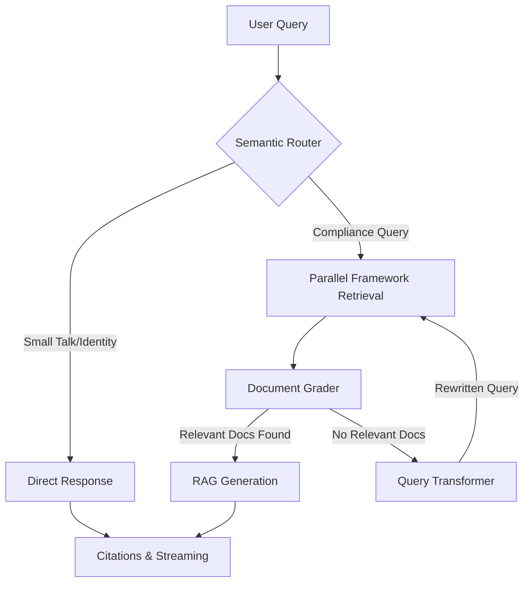

# 🤖 AuditAI: Multi-Framework Cybersecurity Compliance Agent

[](https://audit-ai-frontend-pi.vercel.app)

AuditAI is a production-grade **Agentic RAG** system that audits organizations against four major cybersecurity compliance frameworks: **NIST CSF 2.0**, **NIST SP 800-53**, **ISO 27001:2022**, and **SOC 2 Trust Services Criteria**.

Unlike standard RAG pipelines, AuditAI uses a **Self-Correcting Graph Architecture** with parallel per-framework retrieval to ensure faithful, citation-backed answers across multiple knowledge bases simultaneously.

---

## 🏗️ Architecture: The "Agentic" Core

### 1. CRAG Flow (Corrective RAG)



- **Semantic Router**: Fast LLM classifier — bypasses vector search for greetings/identity questions
- **Parallel Framework Retrieval**: 4 concurrent `ThreadPoolExecutor` searches, one per framework (k=4 each = 16 chunks total). Guarantees equal representation regardless of document size
- **Document Grader**: Evaluates each chunk for relevance — runs all grades concurrently via `asyncio.gather`
- **Query Transformer**: Rewrites failed queries using domain-specific terminology, loops back up to 3 times
- **Semantic Cache**: Qdrant-backed cache (cosine similarity threshold 0.93) — skips the graph entirely on near-duplicate queries

### 2. Hallucination Control
- **Page-Level Citations**: Every claim traced back to framework name + PDF page number
- **Refusal-Aware Suppression**: If generation contains known refusal phrases, citation cards are suppressed client-side
- **Temperature 0**: Deterministic generation — no creative embellishment

### 3. Streaming
Server-Sent Events via FastAPI `StreamingResponse` with NDJSON:
```json
{"type": "token", "content": "The"}
{"type": "sources", "content": [{"file": "NIST SP 800-53", "page": 335, "text": "..."}]}
```

---

## 🧠 Tech Stack

| Component | Technology |
| :--- | :--- |
| **Orchestration** | LangGraph (stateful CRAG graph) |
| **LLM** | `gemini-3.5-flash` |
| **Embeddings** | `gemini-embedding-001` |
| **Vector DB** | Qdrant Cloud (payload-indexed per framework) |
| **API** | FastAPI + SSE streaming |
| **Frontend** | Next.js 16, Tailwind CSS v4, Framer Motion |
| **Deployment** | Render.com (backend) + Vercel (frontend) |

---

## 📊 Evaluation Results (RAGAS)

Evaluated across 33 questions spanning all 4 frameworks + cross-framework comparison queries.

| Metric | Score |
| :--- | :--- |
| **Faithfulness** | `0.9673` ✅ |
| **Answer Relevancy** | `0.7758` ✅ |
| **Context Precision** | `0.7936` ✅ |
| **Context Recall** | `1.0000` ✅ |

> See [evals/ragas_report.md](evals/ragas_report.md) for full per-question breakdown.

### ⚖️ LLM-as-Judge (cross-family validation)

RAGAS uses Gemini as its internal judge — the same family that generates answers, which risks **self-preference bias** (a model grading its own family too leniently). To validate the scores independently, a second rubric-based judge grades every answer 1–5 on four axes.

Two judges run the identical rubric:
- `evals/judge.py` — Gemini judge (`gemini-2.5-flash-lite`)
- `evals/judge_claude.py` — **cross-family** judge (`claude-sonnet-5`), a different model family from the generator

| Dimension | Gemini Judge | Claude Judge (independent) |
| :--- | :--- | :--- |
| **Correctness** | `4.88` | `4.94` |
| **Groundedness** | `5.00` | `4.97` |
| **Completeness** | `4.62` | `4.88` |
| **Relevance** | `5.00` | `5.00` |

Both judges converge within ~0.25 across all dimensions — independent model families agreeing that the signal is real, not a model flattering itself. The cross-family judge originally exposed a verbosity defect (relevance `4.12`) that the same-family judge masked at `5.00`; tightening the generation prompt and upgrading the generator closed the gap.

> Requires `ANTHROPIC_API_KEY` in `.env` for the cross-family judge. See [evals/judge_claude_report.md](evals/judge_claude_report.md).

---

## 📚 Knowledge Base

| Framework | Focus |
| :--- | :--- |
| **NIST CSF 2.0** | High-level cybersecurity framework (Identify, Protect, Detect, Respond, Recover) |
| **NIST SP 800-53** | Detailed security & privacy controls catalog for information systems and organizations |
| **ISO 27001:2022** | International ISMS standard — risk-based approach to information security |
| **SOC 2 TSC** | AICPA Trust Services Criteria — security, availability, confidentiality, privacy |

---

## 📂 Project Structure

```text
audit-ai/
├── src/audit_ai/
│   ├── config.py            # API keys, model names, tuning knobs
│   ├── rag/
│   │   ├── engine.py        # LangGraph CRAG graph, router, semantic cache
│   │   └── ingestion.py     # Multi-PDF ingestion with Qdrant payload index
│   └── api/
│       └── main.py          # FastAPI app, SSE streaming, source filtering
├── frontend/                # Next.js frontend
├── evals/                   # RAGAS + LLM-as-judge evaluation pipeline
│   ├── collector.py         # collect answers → rag_results.json
│   ├── evaluator.py         # RAGAS metrics → ragas_report.md
│   ├── judge.py             # Gemini LLM-as-judge → judge_report.md
│   └── judge_claude.py      # cross-family Claude judge → judge_claude_report.md
├── data/                    # PDF knowledge base (4 frameworks)
├── docker-compose.yml
├── render.yaml
└── pyproject.toml
```

---

## 🚀 Getting Started

### Prerequisites

Create `.env` in project root:

```bash
GOOGLE_API_KEY=<key from https://aistudio.google.com/app/apikey>
QDRANT_URL=<your Qdrant Cloud URL>
QDRANT_API_KEY=<your Qdrant Cloud API key>

# Optional — only for the cross-family LLM-as-judge (evals/judge_claude.py)
ANTHROPIC_API_KEY=<key from https://console.anthropic.com>
```

### Install & Run

```bash
# Install dependencies (uses uv)
uv sync

# Ingest PDFs into Qdrant (place PDFs in data/ first)
uv run python src/audit_ai/rag/ingestion.py

# Start backend
uv run uvicorn audit_ai.api.main:app --reload
# → http://localhost:8000

# Start frontend (from frontend/)
npm install && npm run dev
# → http://localhost:3000
```

### Evaluation

```bash
uv sync --group evals
uv run python evals/collector.py     # collect answers → rag_results.json
uv run python evals/evaluator.py     # RAGAS metrics → ragas_report.md
uv run python evals/judge.py         # Gemini LLM-as-judge → judge_report.md
uv run python evals/judge_claude.py  # cross-family Claude judge → judge_claude_report.md
```

> `judge_claude.py` needs `ANTHROPIC_API_KEY` in `.env`. All three scorers read the same `rag_results.json`, so run `collector.py` first, then any scorer in any order.

---

## 🛠️ Deployment

- **Backend**: Render.com via `render.yaml` — `uvicorn audit_ai.api.main:app --host 0.0.0.0 --port 8000`
- **Frontend**: Vercel — set `NEXT_PUBLIC_API_URL` to your Render backend URL
- **Docker**: `docker-compose up --build`
