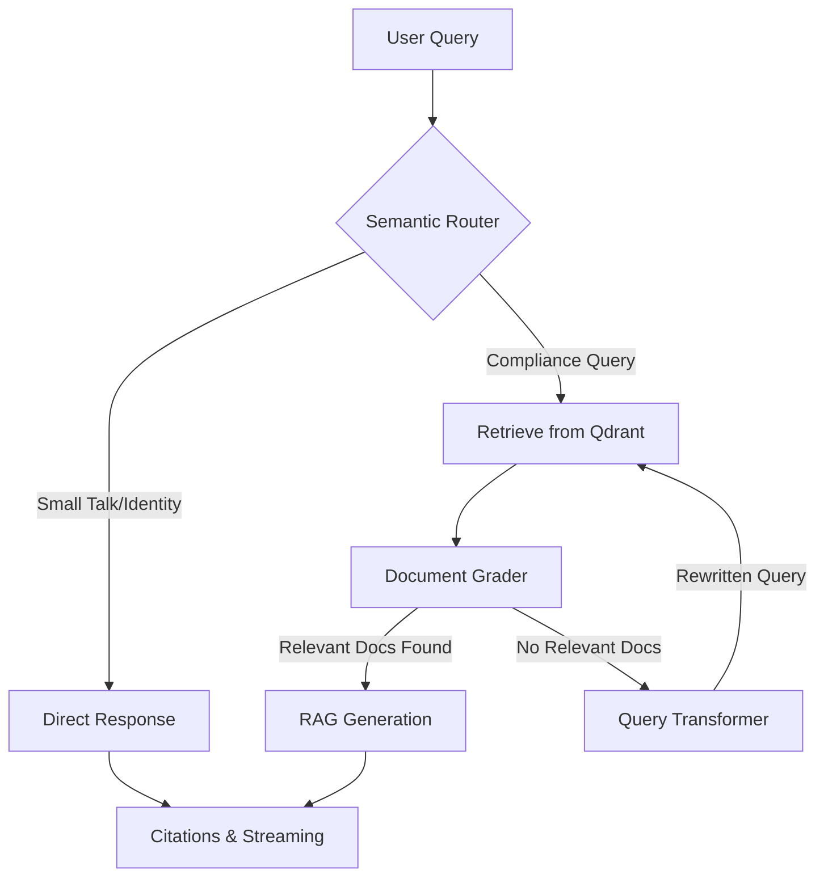

# 🤖 AuditAI: Autonomous Agentic RAG for NIST Compliance

[](https://audit-ai-frontend-pi.vercel.app)

AuditAI is a production-grade **Agentic RAG** system designed to audit internal organizational policies against the **NIST Cybersecurity Framework (CSF 2.0)**.

Unlike standard RAG pipelines, AuditAI utilizes a **Self-Correcting Graph Architecture** to ensure 100% faithfulness, strictly enforced reasoning, and dynamic retrieval optimization.

---

## 🏗️ Advanced Architecture: The "Agentic" Core

AuditAI is powered by a directed acyclic graph (DAG) orchestrated via **LangGraph**. This allows the system to move beyond "one-shot" retrieval into a multi-step reasoning process.

### 1. The Self-Correction Loop
The system implements a **CRAG (Corrective RAG)** pattern to handle low-quality retrieval:



*   **Semantic Router**: A fast-path LLM classifier that identifies intent. It bypasses the heavy graph for greetings or identity questions, reducing latency and cost.
*   **Document Grader**: Evaluates retrieved chunks for semantic relevance to the query.
*   **Query Transformer**: If the grader finds insufficient context, this node rephrases the user's question into a more optimized search query for vector retrieval, triggering a loop-back (up to 3 retries).

### 2. Hallucination Control & Citations
AuditAI implements a "Strict Evidence" policy:
*   **Page-Level Citations**: Every claim is mapped back to specific PDF page numbers and document names.
*   **Refusal-Aware Suppression**: If the model determines the answer is missing from the database, the backend **dynamically suppresses** citation cards to prevent misleading the user with irrelevant sources.

---

## 🧠 AI Engineering Stack

| Component | Technology | Rationale |
| :--- | :--- | :--- |
| **Orchestration** | LangGraph | Complex state management and cyclic loops (Self-Correction). |
| **LLM** | `gemini-2.0-flash-lite` | Low-latency, cost-effective Gemini model for generation, routing, and grading. |
| **Eval Judge** | `gemini-2.5-flash-lite` | Stronger reasoning model used exclusively for RAGAS evaluation. |
| **Embeddings** | `gemini-embedding-001` | High semantic density for technical compliance text. |
| **Vector DB** | Qdrant Cloud | High-performance vector search with metadata filtering support. |
| **API** | FastAPI (Async) | Supports Server-Sent Events (SSE) for real-time token streaming via NDJSON. |

---

## 📊 Evaluation Results (RAGAS)

| Metric | Score | Status |
| :--- | :--- | :--- |
| **Faithfulness** | `1.0000` | ✅ |
| **Answer Relevancy** | `0.7574` | ✅ |
| **Context Precision** | `0.7838` | ✅ |
| **Context Recall** | `0.9000` | ✅ |

> [!TIP]
> **View the [Full Report](evals/ragas_report.md)** for detailed per-question analysis.

### Key Metrics Defined:
1.  **Faithfulness**: Measures if the answer is derived strictly from the retrieved context.
2.  **Answer Relevancy**: Assesses how well the response addresses the user's intent.
3.  **Context Precision**: Evaluates the signal-to-noise ratio in retrieved chunks.
4.  **Context Recall**: Checks if all necessary information was actually retrieved.

---

## 📂 Project Structure

```text
audit-ai-backend/
├── src/audit_ai/
│   ├── config.py       # Centralized API keys, model names & configuration
│   ├── engine.py       # Core LangGraph logic — state, nodes & router
│   ├── ingestion.py    # PDF processing & vector ingestion pipeline
│   └── main.py         # FastAPI application, SSE streaming & entry point
├── evals/
│   ├── collector.py    # Dataset collection from the live RAG engine
│   ├── evaluator.py    # RAGAS evaluation runner & report generator
│   ├── rag_results.json# Raw answers collected during eval run
│   ├── ragas_report.md # Generated evaluation report (human-readable)
│   └── test.csv        # NIST compliance test dataset (Ground Truth Q&A)
├── data/               # Raw NIST PDF documents for ingestion
├── Dockerfile          # Multi-stage production build (Python 3.12)
├── docker-compose.yml  # Local container orchestration
├── render.yaml         # Render.com deployment configuration
└── pyproject.toml      # Project metadata & dependencies (uv/hatchling)
```

---

## 🚀 Getting Started

### Prerequisites
Obtain the following API keys and add them to your `.env` file:

| Variable | Source |
| :--- | :--- |
| `GOOGLE_API_KEY` | [Google AI Studio](https://aistudio.google.com/app/apikey) |
| `GROQ_API_KEY` | [console.groq.com](https://console.groq.com) |
| `QDRANT_URL` | [Qdrant Cloud](https://cloud.qdrant.io) |
| `QDRANT_API_KEY` | [Qdrant Cloud](https://cloud.qdrant.io) |

### Installation

1.  **Install dependencies** using [uv](https://github.com/astral-sh/uv):
    ```bash
    uv sync
    ```
2.  **Set up environment variables**:
    ```bash
    cp .env.example .env
    # then fill in your keys
    ```

### Execution

*   **Run the backend server**:
    ```bash
    uv run python src/audit_ai/main.py
    ```
    The API will be available at `http://localhost:8000`. Interactive docs at `http://localhost:8000/docs`.

*   **Ingest documents** into Qdrant:
    ```bash
    uv run python src/audit_ai/ingestion.py
    ```

*   **Generate an Evaluation Report**:
    ```bash
    # Step 1: Collect answers from the live RAG engine
    uv run python evals/collector.py

    # Step 2: Run RAGAS evaluation & generate the report
    uv run python evals/evaluator.py
    ```

---

## 🛠️ Deployment

*   **Containerization**: Optimized with multi-stage Docker builds using Python 3.12.
    ```bash
    docker-compose up --build
    ```
*   **Cloud (Render)**: Deployment is configured via `render.yaml` for zero-config deploys on [Render.com](https://render.com).
*   **Entry point**: `uvicorn audit_ai.main:app --host 0.0.0.0 --port 8000`
